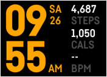

# Dual clock
Dual clock - based on Fitbit's "Stats" clock face design. Fitbit Ionic only.

Features: 
- Add a clock for different time zone via clock face settings page. 
- Tap on time to toggle between clocks. 
- Tap on stats to toggle between activity stats.

The Dual clock is not endorsed by Fitbit.
